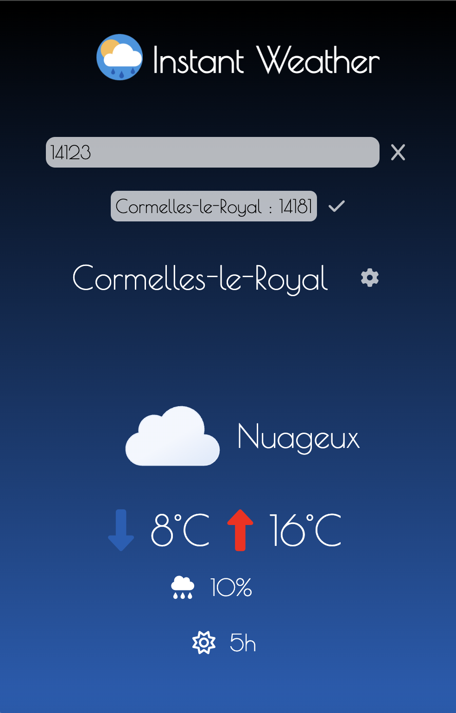

# ☀️ [INSTANT WEATHER](https://colin2005h.github.io/INSTANT-WEATHER/) 🌧️

Welcome to **INSTANT WEATHER**! This project provides a quick and easy way to check the weather anywhere in France. 🇫🇷

## 🚀 Features

- 🌡️ **Real-time Weather Data**: Get the latest weather updates for any location in France.
- 🌦️ **Weather Forecast**: See the forecast for the upcoming days.
- 📱 **Responsive Design**: Optimized for both desktop and mobile devices.

## 🛠️ Technologies Used

- **JavaScript**: The main programming language used. 
- **CSS**: For styling the application. 🎨
- **HTML**: The structure of the web page. 🌐

## 📸 Screenshots

## © Credits

Made with ❤️ by [Colin.H](https://github.com/Colin2005H), [Alban.G](https://github.com/poussone)🐥, [Noa.F](https://github.com/Nonosthecrack)
